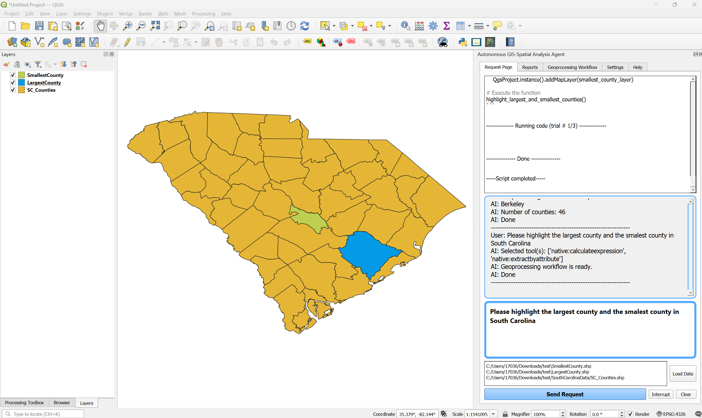

# Case Studies
The case studies demonstrate the capabilities of the Spatial Analysis Agent across three categories:

1. Tool Selection Capability: Showcases the agent's ability to identify and recommend the appropriate tool(s) for specific operations.
2. Code Generation Accuracy: Demonstrates the agent's proficiency in generating executable code to perform various spatial analysis tasks.
3. End-to-End Problem Solving: Evaluates the agent's ability to select the appropriate tool, generate the correct code, and successfully execute the complete operation.

## Level 1: Tool Selection Capability
### Case 1.1: Add new fields for x and y to the fast food restaurants layer, then extract the elevation values from the DEM layer and save the results in a new layer.

### Case 1.2: Perform the following task: 1) Reproject this road vector layer to NAD27/ UTM Zone 10 . 2) Create a new field that contains the length of the road features. Let the name of the field be "Length". 3) Extract roads that have length shorter than 100-meters.

### Case 1.3: Can you please delete all the empty columns?

## Level 2: Code Generation Accuracy
### Case 2.1: "Calculate the ruggedness index for Penssylvania, then summarize the ruggedness index value for each counties"

### Case 2.2: "Create barchart showing obesity prevalence in the United States. Ensure all labels are clear"

### Case 2.3: Perform the following tasks: 1) Count the fast food restaurants in each county and store the result in a new field named "Count". 2) Calculate the fast food accessibility score for each county as (Count / Population) * 1,000 and store the result in a new field named "Score". 3) Create a thematic map showing the fast food accessibility score for each county. 

### Case 2.4: Perform the following task: 1) Clip the DEM to PA Boundaries and load the clipped DEM. 2) Generate the zonal statistics for every county in PA, focusing on average elevation. 3) Create a choropleth map showing the average elevation of each county in PA, using a red color gradient to represent elevation differences. Load the Choropleth map

### Case 2.4: Please highlight the largest county and the smalest county in South Carolina.

## Level 3: End-to-End Problem Solving

### Case 3.1: "Can you please generate a HTML report to show the building area for each building? You can look at the columns information, if no building area exists, please calculate yourself. Also make sure to use map projection when calculating area."

### Case 3.2: "What kind of analysis can I do for the DEM data?"

### Calculate the correlation coefficients between obesity rates and supermarket visit rates for each states in the USA. Let the result be in html format

### Case 3.3: Apply an affine transformation to the vector layer to scale by a factor of 2 and rotate 30 degrees.

### Case 3.4: Can you please select the residential area and calculate the total area covered by the residential area in square kilometers

### Case 3.5: Can you please create 20 random points in the DEM extend, and extract the elevation value for each point?

### Case 3.6: Could you please show me the change in population from year 2000 to year 2008 for each counties in South Carolina?

### Case 3.7: Generate contour lines based on the DEM using interval of 2. Add the evelation as an attribute to the contour line layer.

